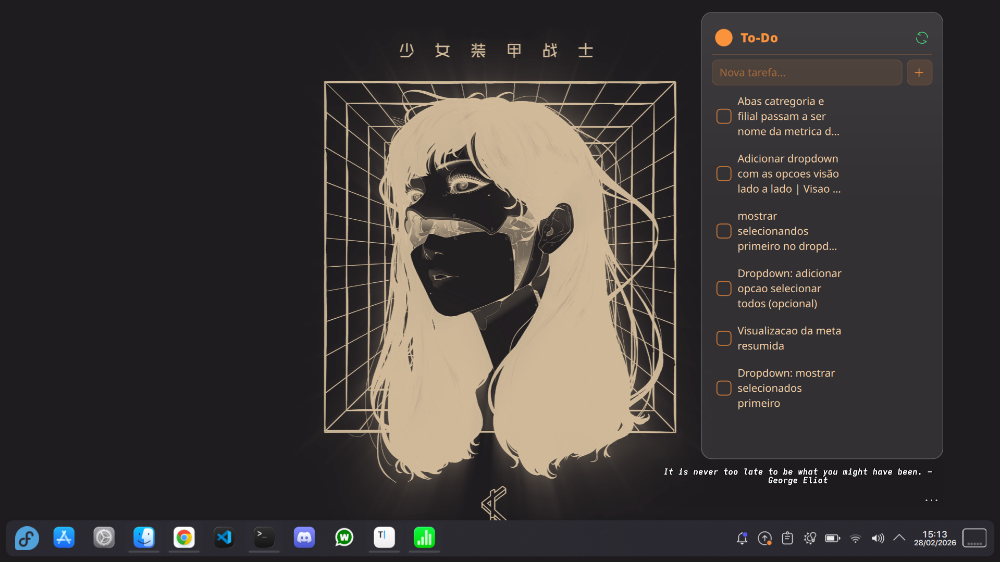

# Transparent To-Do — KDE Plasma 6 Widget

Widget de lista de tarefas para KDE Plasma 6 com suporte a:

- 🎨 **Visual totalmente customizável** — cada cor da interface é configurável individualmente
- 🪟 **Três modos de fundo** — Opaco, Glass e 100% Transparente
- ☁️ **Sincronização via JSONBin.io** — compartilhe tarefas entre monitores ou máquinas
- ✏️ **Edição inline** — duplo clique para editar qualquer tarefa
- 🔄 **Ícones do sistema** — usa Kirigami.Icon seguindo o tema do KDE
- 💾 **Persistência local** — tarefas salvas na config do Plasma, sem dependências externas

## Preview



## Instalação

### Via arquivo (recomendado)

```bash
# Clone o repositório
git clone https://github.com/jesieldotdev/plasma-todo-widget
cd plasma-todo-widget

# Instala
kpackagetool6 --install . --type Plasma/Applet

# Reinicia o Plasma
plasmashell --replace &
```

### Manual

```bash
cp -r . ~/.local/share/plasma/plasmoids/org.kde.plasma.transparenttodo
plasmashell --replace &
```

## Atualização

```bash
kpackagetool6 --upgrade . --type Plasma/Applet
plasmashell --replace &
```

## Desinstalação

```bash
kpackagetool6 --remove org.kde.plasma.transparenttodo
```

## Configuração

Clique com o botão direito no widget → **Configurar...**

### Sincronização entre monitores (JSONBin.io)

1. Crie uma conta grátis em [jsonbin.io](https://jsonbin.io)
2. Vá em **API Keys** → gere uma **Master Key**
3. Clique em **New Bin** → crie com conteúdo `{}` → copie o **Bin ID** da URL
4. Cole os valores nas configurações do widget
5. Repita nos outros monitores com os **mesmos valores**

O widget sincroniza automaticamente no intervalo configurado (padrão: 30s) e a cada ação do usuário.

### Cores

Cada elemento da interface tem sua própria cor configurável com suporte a canal alpha:

| Elemento | Descrição |
|----------|-----------|
| Título | Texto "To-Do" e ícones do cabeçalho |
| Tarefa normal | Texto das tarefas pendentes |
| Tarefa concluída | Texto das tarefas marcadas |
| Placeholder | Texto de dica do campo de input |
| Texto vazio | Mensagem quando não há tarefas |
| Linha divisória | Separador entre título e lista |
| Checkbox borda | Contorno do quadrado de marcar |
| Checkbox fill | Preenchimento quando marcado |
| Checkbox ícone | Cor do ✓ dentro do checkbox |
| Input fundo | Fundo do campo de texto |
| Input borda | Contorno do campo de texto |
| Botão + fundo | Fundo do botão adicionar |
| Botão + borda | Contorno do botão adicionar |
| Botão + ícone | Ícone do botão adicionar |
| Hover tarefa | Realce ao passar o mouse |
| Ícones de ação | Editar, mover, deletar |

### Presets incluídos

🤍 Branco Glass · 🖤 Preto Smoke · 💙 Azul Neon · 🌸 Rosa Pastel · 🌙 Roxo Dark · 🍊 Laranja · 🌿 Verde

## Estrutura do projeto

```
plasma-todo-widget/
├── metadata.json              # Metadados do widget (ID, nome, versão)
├── README.md
└── contents/
    ├── config/
    │   └── main.xml           # Schema de configurações
    └── ui/
        ├── main.qml           # Interface principal do widget
        ├── config.qml         # Registro das páginas de configuração
        └── configAppearance.qml  # UI de configuração (cores, fonte, sync)
```

## Requisitos

- KDE Plasma 6.0+
- Qt 6.x
- Kirigami2

## Licença

GPL-2.0-or-later
